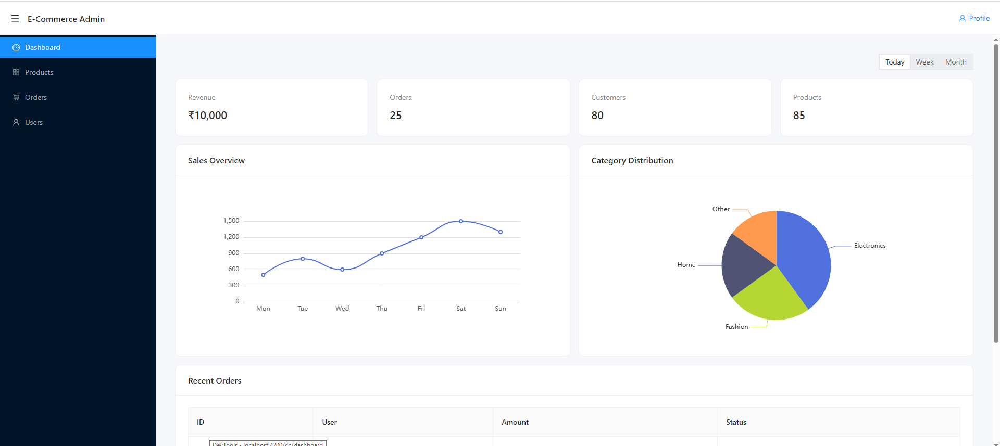
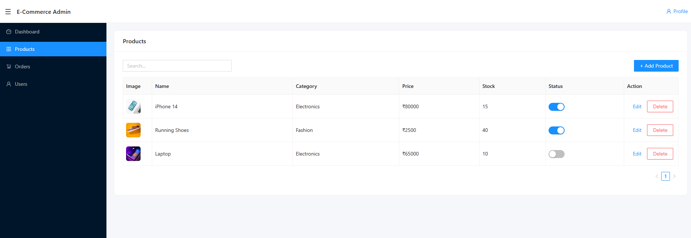
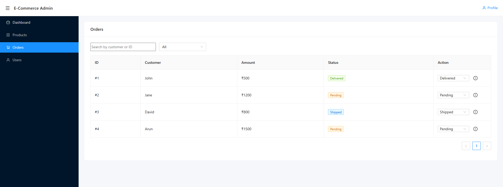
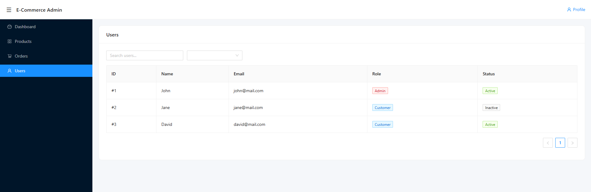

# Angular E-Commerce Admin Dashboard

## 📌 Overview
This is a scalable e-commerce admin dashboard built using Angular, designed to manage products, users, and orders with a clean and modular architecture.

The application provides a complete admin workflow starting from authentication to dashboard analytics and management modules, reflecting real-world enterprise frontend practices.

---

## 🌐 Live Demo
https://dhanapriya-dahsboard-2026.vercel.app/login

---

## 🛠 Tech Stack
- Angular 17+
- TypeScript
- RxJS
- NG-ZORRO (UI Library)
- HTML / CSS

---

## 🚀 Features

### 🔐 Authentication
- Secure login and logout functionality
- Route guards for protected navigation
- Session-based access control

---

### 📊 Dashboard (Main Dashboard)
- KPI cards (Revenue, Orders, Customers, Products)
- Sales Overview chart (weekly trend)
- Category Distribution pie chart
- Recent Orders table with status tracking
- Time-based filter (Today / Week / Month)

---

### 🛍️ Products Module
- Product grid view
- Add product form (Reactive Forms)
- Edit product functionality
- Delete product option
- Search and basic filtering

---

### 📦 Orders Module
- Orders grid view
- Order update/edit functionality
- Delete order option
- Displays order details (user, amount, status)

---

### 👤 Users Module
- Users grid view
- Displays user details
- Structured listing for management

---

## ⚙️ Core Features
- Reactive forms with validation
- Modular architecture (Core, Shared, Feature modules)
- REST API integration
- Reusable components and services
- Sidebar-based navigation layout
- Responsive UI using NG-ZORRO

---

## 📂 Project Structure

src/app/
  core/        → Authentication, services, interceptors  
  shared/      → Reusable components, pipes, directives  
  features/    → Dashboard, products, orders, users modules  

---

## ⚡ Performance Optimizations
- OnPush change detection strategy
- Lazy loading of feature modules
- Efficient RxJS usage (debounceTime, switchMap, shareReplay)
- trackBy function in ngFor to reduce DOM re-rendering

---

## ▶️ How to Run

npm install  
ng serve  

Then open: http://localhost:4200/

---

## 📸 Screenshots

The following screenshots demonstrate key modules of the application:

### 🔐 Login Page

### 📊 Dashboard (Main Dashboard)

### 🛍️ Products Module

### 📦 Orders Module

### 👤 Users Module

---

## 🎯 Key Highlights
- Clean and professional admin dashboard UI  
- Covers complete admin workflow (login → dashboard → modules)  
- Includes data visualization (charts and analytics)  
- Built using scalable Angular architecture  
- Focused on performance, maintainability, and user experience  

---

## 📌 Purpose
This project demonstrates real-world Angular application development, including dashboard design, modular architecture, CRUD operations, and performance optimization.
